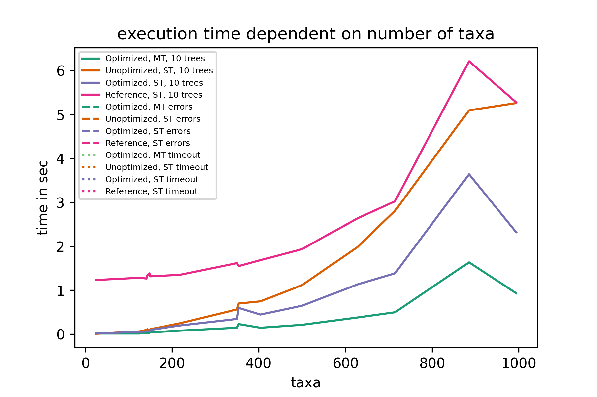
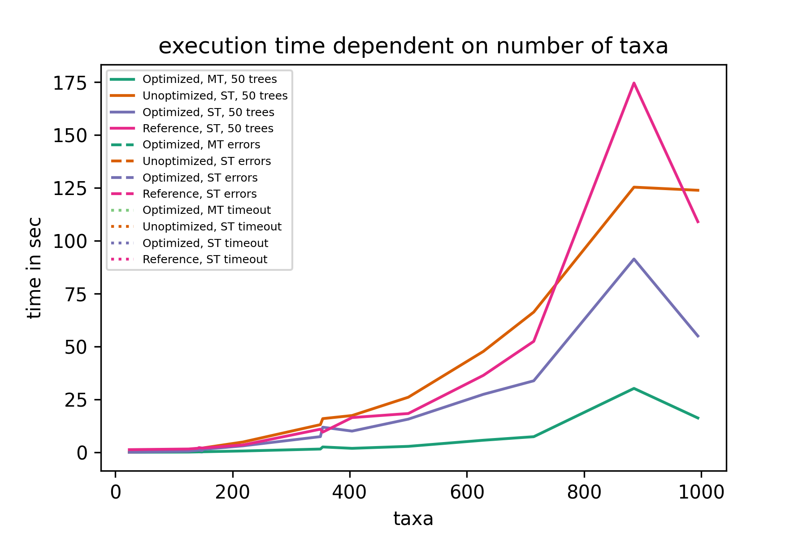
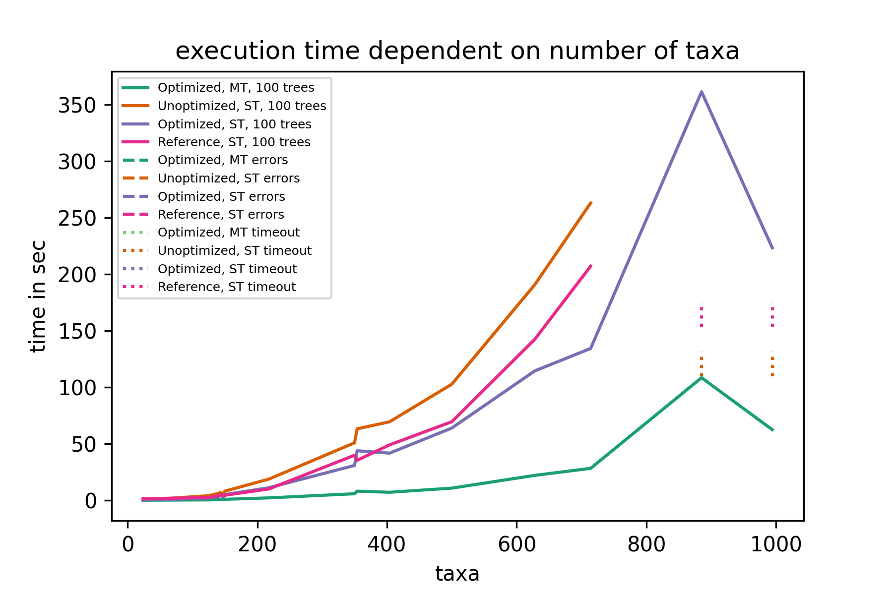

# Introduction

Written as part of the 2021 KIT bioinformatics practical. The program can calculate the RF distance and the [generalized RF distances][1].
To get started clone the repository:

```
git clone --recursive git@github.com:DoktorBotti/RF_Metrics.git
```

# Building
Prerequisites:
 - boost [Version 1.76.0][2]
   > The log and threading component need to be compiled:  
   > `./bootstrap.sh --with-libraries=thread,log --with-toolset=<your-compiler-here> && ./b2`  
   > then point to the created compilation or install the components with `./b2 install`
 - OR-Tools Version 9.0.9048, [here][3] are the binary releases for most OSes.

These dependencies will be found in standard locations and by setting the ORTOOLS_ROOT / BOOST_ROOT CMake or environment variable.

# Running the program
`commandline_rf --metric [ RF | MCI | MSI | SPI ] -i [input-file-path] -o [output-file-path] -n [true|false] -p [number of threads or -1 for auto]`
The input must be in the Newick format.
The output contains the pairwise distances of all trees given in the input.
The normalization if turned on will divide all results by the maximum score in the current calculation.
Parallelization is set to num_procs of your machine when no -p option is provided ( equivalent to -p -1)

# Performance
The benchmarks took place on a six core Ryzen 5 3600 with 16 GB of ram. 
We evaluated our results with  2, 10, 50, 100, 130 trees respectively. 
We also tested multiple problem configurations with up to 1000 taxa. 
However, our implementation could handle much more.  
The first plot shows the average execution time per metric. We divided each measurement by its taxa count to counteract the influence of different problem sizes.

The following plots show the execution time, recorded with a different tree input size per plot.
The vertical lines represent either timeouts or errors during calculations for their respective color.
These plots only show timeouts, since this benchmark was only performed on small instances.
With increasing tree and taxa count, the ram will not suffice which results in a BAD_ALLOC.





The plots below show speedup and also the execution time dependent on the tree count, averaged over all taxa instances.


[1]: https://doi.org/10.1093/bioinformatics/btaa614
[2]: https://boostorg.jfrog.io/artifactory/main/release/1.76.0/source/boost_1_76_0.tar.bz2
[3]: https://github.com/google/or-tools/releases/tag/v9.0